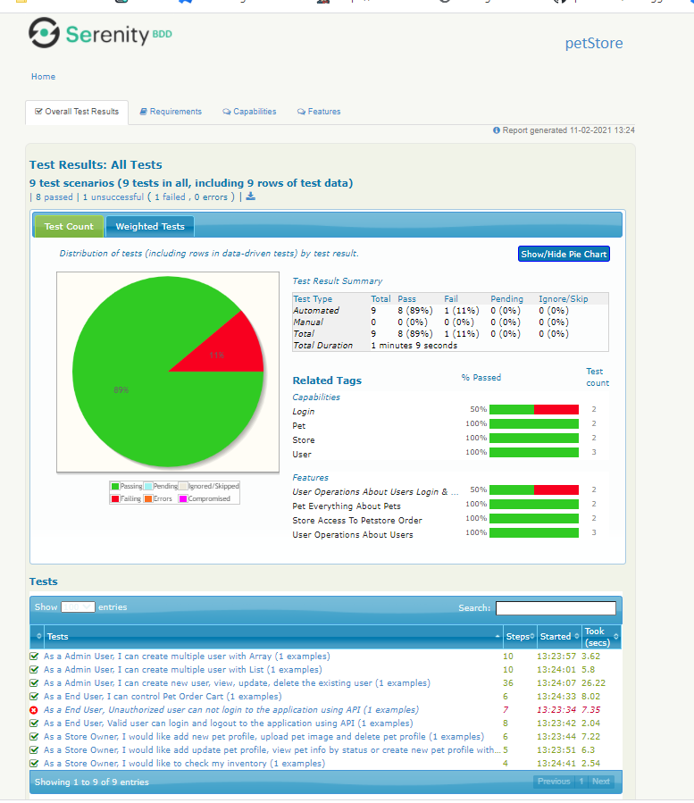

# Appplicatin : PetStore
Pet store is Serenity BDD framework based REST API Automation project. Imagine you are a part of the team that perfoms quality assuarnce for a Pet store application, The frontend design is under development but API has already been published. QA collobrate with developer team to make the feature  more robusy, by targetting to write tests for some workflows that they might break while developing busines logic. 
```
Goal is to cover: 
* To create a test automation framework skeleton
* To test the application using available endpoint
```
* Reference: Swagger URL# https://petstore.swagger.io/#/pet/updatePet


Testing REST services in Java
Techonlogy used - Serenity, REST Assured, Cucumber and JAVA

# Prerequisite
* JAVA 8 or higher
* As Integrated Development Environment - Used Eclipse Version: 2020-12 (4.18.0)
* A Buid Tool - Used Maven

# Getting Started
* Clone this repository - gh repo clone gaurang053/petStore

# How to execute this project?
* Double click on execute.bat file present at root  or 
* or Execute maven command - mvn clean verify

# Story Descriptin
Below list of story covere API capabilities of Login, PetProfile, Store and User. The story design such a way it cover all APIs present in the swagger. 
	
* User - Operations about users 
```
1_ As a End User, I can login and logout to the application using API
Description: Valid and Invalid Scenario covered
API Scenarion:
* GET /user/login - Logs user into the system
* GET /user/logout - Logs out current logged in user session
```
```
2_ As a Admin User, I can create new user, view or update existing user information and delete the user 
Description: Create new user, View user information, Update or Delete Existing user
API Scenarion:
* POST /user Create user
* GET /user/{username} Get user by username
* PUT /user{username} Updated user
* DELETE /user/{username} Delete User
* POST /user/createWithArray Creates list of users with given input array
* POST /user/createWithList Creates list of users with given input array
```

* Store - Access to Petstore order 
```
3_ As a End User, I can control Pet Order Cart
Descriptoin : Place new order, Find or Delete purchase order by ID
* POST /store/order Place an order for a pet
* GET /store/order/{orderid} Find purchase order by ID
* DELETE /store/order/{orderId} Delete purcahse order by ID
```
```
4_ As a Store Owner, I would like to check my inventory
Descriptoin : Check Inventory
* GET /store/inventory Return pet inventories by status
```
* Pet - Everything about Pets 
```
5_As a Store Owner, I would like add new pet profile, upload pet image and delete pet profile
Description : Create, Upload image, Search or Delete Pet profile 
* POST /put Add an new pet to the store
* GET /pet/{petId} Find pet by ID
* DELETE /pet/{petId} Delete a pet
* POST /put/{petId}/uploadImage upload an Image
```
```
6_ As a Store Owner, I would like add update pet profile, view pet info by status or create new pet profile with form data
Description : Create, Update a pet profile with body or form data and Find Pet By Status
* POST /put Add an ew pet to the store
* GET /pet/findByStatus Finds Pets by status
* PUT /pet Add a new pet to the store
* POST /pet/{petId} Update ta pet in the store with form data
```
# Reference Test Report



